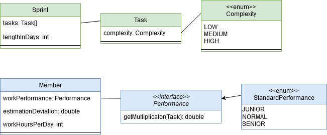

# Sprint Simulation

[](https://travis-ci.com/slothsoft/sprint-simulation)

**Content:**

- [Preface](#preface)
- [Overview](#overview)
    - [Estimation](#estimation) 
    - [Execution](#execution) 
- [Results](#results)
- [Real Life](#real-life)
- [Links](#links)


# Preface

Currently, I've gotten into a lot of discussions over the question: *"In scrum should we pre-assign tasks during sprint planning?"*

I'm absolutely **for** pre-assigning tasks, because:

- It's easier to address individual capacities (e.g. the never-before-heard "part-time")
- It's fairer ("You do this ugly bug, and I'll do that one.")
- It's more efficient (just give the task to whoever estimates the fastest time)
- It makes the planning faster (everybody has to understand only their own tasks, and team members can even prepare for that)
- Many bugs are already implicitly pre-assigned, because team members are experts in different things
- You don't double book people (e.g. by adding two tasks that can only be done by one person efficiently, when each of them alone would fill out the time of that person completely)

My team is against it, because:

1. It's not fail-safe (if a member can't participate in the sprint, nobody can take on their tasks)

(I don't think there was ever a second argument.)

And just to address this:

1. "Nobody can take on their tasks" - this is exactly what happens in our team. And we don't pre-assign. It's just that nobody will do implicitly assigned tasks. For good reason. If the expert can do it next sprint, why should I half-ass their tasks?

I have another suspicion why pre-assigning tasks is better, and that is our horrible estimations. It's clear that you never learn to estimate if you can't practice, so in that regard pre-assignments are already better. However, I have a hunch that even with good estimations it won't work if multiple people estimate, and only one of those does the task.

*This project was born to simulate sprint planning and execution, and figure out if you can estimate tasks as a group.*


# Overview




This project makes some assumptions:

- **`Sprint`**
    - a sprint consists of **`Task`s**
        - tasks have a **`Complexity`** (i.e. "story points")
            - for this simulation, we have three complexities (if your standard task is 3sp, think of them maybe as 1sp, 3sp and 8sp)
    - a sprint has a length in days
- **`Member`**
    - a team member has a work **`Performance`**
        - we have three standard performances, but you can always add your own (i.e. a team member that is good in some task and bad in others)
    - a team member's estimation deviates from reality by an error margin in _both directions_, but on average the member *estimate correctly*
    - a team member has a fixed set of hours they can work each day
    

## Estimation    

*(See [SprintGenerator](core/src/main/java/de/slothsoft/sprintsim/generation/SprintGenerator.java))*

1. The team **`Member`s** get together
2. A **`Task`s** is created from the never-ending task machine (see [TaskCreator])(core/src/main/java/de/slothsoft/sprintsim/config/TaskCreator.java)
3. Each team member estimates how long it will take to do the task (for *them*) - for that they take the time it *will* take them to do the task, and use a Gaussian curve capped at their `estimationDeviation` to add a bit of variance; on average this means they will estimate correctly
4. Am operation is used to get the team's estimation from the member's (average right now)
5. If there is still hours left in the **`Sprint`**, start again at 2.


## Execution    

*(See [SprintExecutor](core/src/main/java/de/slothsoft/sprintsim/execution/SprintExecutor.java))*
    
1. The team **`Member`s** and **`Task`s** get together
2. Tasks are sorted by complexity, so longer tasks are done earlier
3. Each task is assigned to the team member who has the most time open to do it
4. The team member does the task and tracks their time
    
    
# Results

To run a single sprint with its information printed on the console, use [SimpleSprintExample](examples/src/main/java/SimpleSprintExample.java). This will print something like this:

```
Team Members
============

Angie (SENIOR, 8h)
Bert (NORMAL, 8h)
Charles (JUNIOR, 8h)

Sprint Planning
===============

Estimated Hours:  240.6925148175762
Additional Hours: 0.6925148175762104

Sprint Retro
============

Remaining Hours: 40.19999999999999
Necessary Additional Hours: -0.0
```

*(**Note:** the results shown are random, but representative examples are shown.)*

Interesting! Our three full-time team members estimated they'd need 240 hours to do their sprint (what a precision!), but had 40 hours left at the end of it. 

That is not at all what I was expecting. 

To analyze why let's have a look at the task overview (`SimpleSprintExample.java` will print this, too):

|           | Angie |  Bert | Charles |  All  | Assignee | Necessary Time | 
| --------- | ---: | -----: | -----: | -----: | ------- | ---: |
| LIO-31415 |  1.4 |   1.93 |  2.664 |  1.998 | Bert    |  2   |
| LIO-31416 |  5.6 |  7.728 | 13.459 |  8.929 | Bert    |  8   |
| LIO-31417 |  5.6 |    8.8 | 10.155 |  8.185 | Charles | 16   |
| LIO-31418 | 11.2 | 16.819 | 35.258 | 21.092 | Angie   | 11.2 |
| LIO-31419 |  1.4 |  1.989 |  4.274 |  2.554 | Angie   |  1.4 |
| LIO-31420 | 11.2 | 14.993 |     48 | 24.731 | Bert    | 16   |
| LIO-31421 | 11.2 | 15.727 | 41.719 | 22.882 | Charles | 32   |
| LIO-31422 |  5.6 |  7.496 | 19.198 | 10.765 | Angie   |  5.6 |
| LIO-31423 |  5.6 |  7.908 | 22.148 | 11.885 | Angie   |  5.6 |
| LIO-31424 |  5.6 |  8.534 | 17.005 |  10.38 | Bert    |  8   |
| LIO-31425 |  5.6 |  8.218 | 20.025 | 11.281 | Angie   |  5.6 |
| LIO-31426 |  5.6 |  8.428 | 11.389 |  8.472 | Bert    |  8   |
| LIO-31427 |  1.4 |  2.126 |  4.599 |  2.709 | Angie   | 1.4  |
| LIO-31428 |  5.6 |   8.22 | 23.581 | 12.467 | Charles | 16   |
| LIO-31429 |  1.4 |  2.137 |  3.352 |  2.296 | Bert    |  2   |
| LIO-31430 |  1.4 |  1.916 |  3.716 |  2.344 | Angie   |  1.4 |
| LIO-31431 | 11.2 | 16.626 | 30.087 | 19.304 | Angie   | 11.2 |
| LIO-31432 |  1.4 |  2.129 |  3.301 |  2.277 | Bert    |  2   |
| LIO-31433 |  1.4 |    1.8 |  2.681 |   1.96 | Angie   |  1.4 |
| LIO-31434 |  1.4 |  2.024 |  2.751 |  2.058 | Angie   |  1.4 |
| LIO-31435 | 11.2 | 14.619 | 25.173 | 16.997 | Bert    | 16   |
| LIO-31436 |  1.4 |  2.031 |   3.59 |  2.341 | Bert    |  2   |
| LIO-31437 | 11.2 |   14.4 |     16 | 13.867 | Angie   | 11.2 |
| LIO-31438 |  1.4 |  1.878 |  4.334 |  2.537 | Angie   |  1.4 |
| LIO-31439 |  1.4 |  2.153 |  3.831 |  2.461 | Bert    |  2   |
| LIO-31440 |  1.4 |  2.093 |  2.663 |  2.052 | Charles |  4   |
| LIO-31441 |  5.6 |    7.2 | 15.038 |  9.279 | Angie   |  5.6 |
| LIO-31442 |  1.4 |   2.14 |  4.222 |  2.587 | Angie   |  1.4 |

Let's take a look at our team members first:

- **Angie** finishes tasks in 70% of the hours and is a perfect guesser
- **Bert** finishes tasks in 100% of the hours and guesses with 10% deviation
- **Charles** finishes tasks in 200% of the hours and guesses with 50% deviation

The interesting tasks are:

- **LIO-31417** - the estimate is 8 hours, but Charles needs 16 hours to do it (and for this task in particular he was a horrible guesser) → 8 hours ➕
- **LIO-31418** - both Bert and Charles try to increase the estimation, but Angie only needs 11 hours → 10 hours ➖
- **LIO-31420** - Charles increases the estimate by a lot, but Bert only needs 16 hours → 8 hours ➖
- **LIO-31421** - Charles needs his time with the issue → 9 hours ➕
- ...

In summary: every time Charles does a task, he needs a lot more time than estimated, Bert's time is a bit better than the estimate and Angie needs a lot less time than estimated. But since Angie can do a lot more tasks than Charles her faster time sums up.

Mathematically speaking, both Angie and Bert are twice as fast as Charles. From their tasks, the additional hours of half of them are needed to allow Charles to work at his slower speed. So the additional hours of the other half is what makes up the "remaining hours".

With that knowledge we can construct another example where the team won't have this many hours remaining at the end of the sprint - we'll give Angie a second project to work on and Bert a child that makes him want to work part-time:


```java
Member angie = Member.createSenior().workHoursPerDay(4);
Member bert = Member.createNormal().workHoursPerDay(4);
Member charles = Member.createJunior();
```

**Result:**

```
Sprint Planning
===============

Estimated Hours:  164.19162271153965
Additional Hours: 4.191622711539651

Sprint Retro
============

Remaining Hours: 0.800000000000002
Necessary Additional Hours: -0.0
```

Now sprints will finish in the time the three of them estimated, because the two faster team members will do about the same number of tasks than the slower one. (With a bit of variance - sometimes they will have 10 hours remaining, but other times they will need additionally 10 hours.)

So if each member gets the same weight in the estimations, but does not work the same number of tasks, estimating together *can not work*. The team tends to be faster than the estimation.

This is surprising, because ever since I joined a team that estimates together, we did not finish one single sprint on time. 

**So why does that not work for us?**

Because Charles is not the perfect guesser this simulation made him. In fact, after estimating two tasks with Angie and Bert he is very good in guessing the same numbers as them - even if he takes a lot more time. Since you do not compare estimations at the end of the sprint (and there is no way you could do that realistically), his behavior has no consequences. 

Charles acts like this:

```java
Member charles = Member.createJunior().workPerformance(task -> {
	// we are in sprint planning, so just guess what Angie and Bert guess
	if (task.getUserData(SprintGenerator.TASK_DATA_COLLECTED_ESTIMATION) == null) return 1;
	// now I'm actually working on it, but I'm slooow
	return 2.0;
});
```

Now the team members guess about the same value, but Charles still takes double the time. Every hour he works costs the team 30min they never estimated. Since he works 80h in a sprint, the team needs about 40h after each sprint to clean up Charles's mess.

```
Sprint Planning
===============

Estimated Hours:  251.91424667361778
Additional Hours: 11.914246673617782

Sprint Retro
============

Remaining Hours: 0.0
Necessary Additional Hours: 47.20000000000001
```

Really, team? It's not a good idea to plan a sprint with 12 more hours than possible with somebody like Charles. But the simulation proofs the theory.

**How do you know this is what is happening?**

This is a conversation I actually had when I estimated my *needed* time: 

- **Team:** "Why would you estimate so much more than us?" 
- **I:** "Because I've never heard of the technology before and I'll need some time to learn it."
- **Team:** "But it's easy!" 
- **I:** "So... you want me to use your estimation?"
- **Team:** "Yes."

This might be because the team doesn't know much about scrum, but I've seen it time and time again: junior members (and others with little knowledge of a task at hand) will usually not estimate their needed time, but try to stay close to their peers. This is often enforced by the team, which mistakenly asks the same questions as for their story point estimation (where it is absolutely okay and even preferred to have everybody guess the same value).

How do we fix this?

I have honestly no practical idea. It should be clear to forbid questions towards the time estimations, even if the estimation is a lot off. But this would work against the case were one or many team members did not understand the task correctly.

Since the entire estimation only works if individual members estimate well, this should be trained. For this you would need to make team members find their original estimation and see how much off they were eventually. For this purpose they should ignore the team estimate. Which of course makes monitoring the tasks hard.

But honestly: *I* estimated I need 10 hours for a task, 4 team members estimated 30min each - which is an average of 2h 30min. Why do I have to beg for the remaining 7h if I never agreed to do it in that time? But that is what is happening again and again. And the team members wouldn't be able to do this in 30min either - they just don't care because they know they won't be doing that task.

Which is, in short, the entire reason why team estimations do not work.

There is one solution that works, but that is not really practical: use teams were everybody has a similar performance. That way estimations that stay just close to the group won't cost the team too much time.


# Real Life  

This is just a simulation, and humans don't act like computer programs. So in reality, these problems (additionally) arise:
    
- of course, most glaringly, you can't calculate hours from story points (but somehow we have to create different-length tasks)
- most of them time, team members will not estimate correctly on average; from what I've seen, even skilled team members will (almost) always over-estimate or under-estimate, even if only by a little
- the performance of a team member is not fix - their health, the day of the week, the hour of the day, distractions, etc. change their needed time
- another thing that changes the "needed time" is the "estimated time" - if a team member is a lot faster than estimated, they might use the remaining time to do something else that is related; if they are a lot slower they might be able to rush things or "outsource" parts of the task into other tasks


# Conclusion

It is not possible to estimate as a team if the actual work performance varies a lot, the team members shame each other from voting a higher time and if nobody checks the individual estimation (instead of the team estimation) versus actual needed time.


# Links

- [DrawIO](https://app.diagrams.net) - to create beautiful diagrams online

